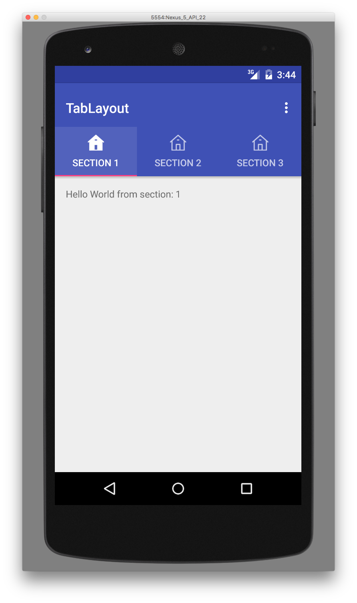

# TabLayout

An Android μlibrary for creating an app bar with icons using TabLayout.


### Usage:

```
repositories {
	   maven {
            url 'https://dl.bintray.com/ambrogio/maven/'
        }
    }
}

dependencies {
    compile 'com.ambrogio.android:tablayout:0.1.1'
}
```

### Screenshot



